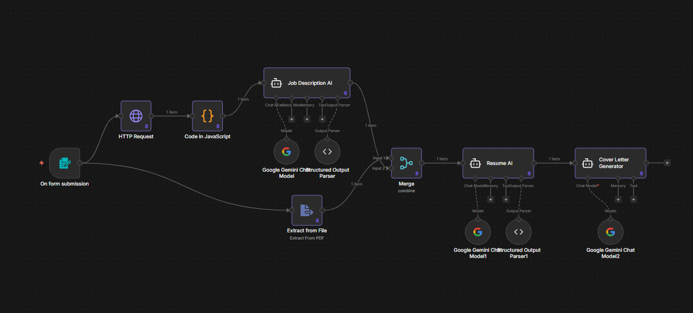

# AI Resume Analyzer (n8n Workflow)

This project is an **AI-powered Resume Analyzer** built using **n8n** that evaluates how well a candidate’s resume matches a given job description. It automates the entire pipeline—from data collection to analysis and personalized feedback—using parallel processing and AI agents.

The workflow takes user input, processes resume and job data concurrently, and generates:
- Match score
- Skill gap analysis
- Improvement suggestions
- Tailored cover letter

---

## Workflow

---

## Features
- Resume parsing and text extraction
- Job description scraping via HTTP request
- Parallel data processing (efficient workflow design)
- AI-based resume-job matching
- Skill gap identification and suggestions
- Auto-generated personalized cover letter
- Structured output for easy interpretation

---

## Workflow Architecture

### 1. User Input (Form Trigger)
The workflow starts with a form that collects:
- Full Name
- Email Address
- Resume (file upload)
- Job Link (URL)

---

### 2. Parallel Processing
After collecting input, the workflow splits into two parallel branches:

#### A. Resume Processing
- Extracts text from the uploaded resume
- Cleans and structures the content for analysis

#### B. Job Description Processing
- Sends an HTTP request to the provided job link
- Retrieves page data (JSON/HTML depending on source)
- Extracts relevant job information such as:
  - Required skills
  - Responsibilities
  - Qualifications

---

### 3. Data Merge
- Combines:
  - Resume content
  - Job description insights
- Prepares structured input for AI analysis

---

### 4. AI Matching Engine
- Sends merged data to an AI model
- Evaluates:
  - Skill overlap
  - Experience relevance
  - Keyword alignment
- Outputs:
  - Match Score (e.g., percentage)
  - Key matching and missing areas

---

### 5. AI Feedback & Cover Letter Generator
A second AI agent:
- Provides detailed improvement suggestions
- Highlights missing skills
- Recommends resume enhancements
- Generates a **custom cover letter** tailored to:
  - The candidate’s resume
  - The target job role

---

## Tech Stack
- **n8n** – Workflow automation
- **HTTP Request Node** – Job data fetching
- **AI API (Google Gemini)** – Analysis and generation
- **File Processing Nodes** – Resume parsing

---

## ▶How to Use
1. Import the workflow JSON into n8n
2. Configure required API credentials (AI provider)
3. Run the workflow
4. Fill in the form with:
   - Resume
   - Job link
5. View output:
   - Match score
   - Suggestions
   - Generated cover letter

---

## Example Output
- Match Score: 78%
- Missing Skills: Docker, System Design
- Suggestions:
  - Add backend project experience
  - Highlight API development
- Cover Letter: Generated based on role and resume

---

## Use Cases
- Students preparing for internships
- Job seekers optimizing resumes
- Automated pre-screening tool
- Career guidance platforms

---

## Future Improvements
- ATS scoring simulation
- Multi-job comparison
- Resume rewriting automation
- Integration with MERN frontend

